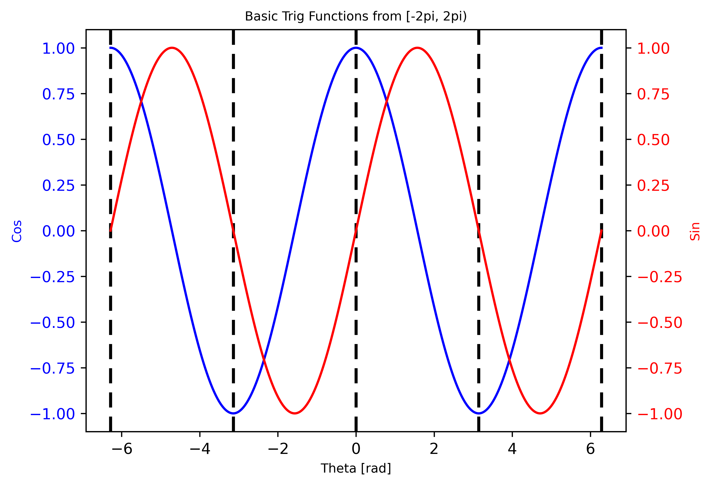

# pixi tutorial
A quick tutorial for the "project manager" `pixi`. Although this tutorial is in python, `pixi` supports many other languages.

(this tutorial is adapted from the [pixi github](https://github.com/prefix-dev/pixi); go here if you want a more in depth explaination of anything here)


- [Overview](#overview)
- [Installation](#installation)
  - [Linux](#linux)
  - [macOS](#macos)
  - [Windows](#windows)
  - [Others](https://github.com/prefix-dev/pixi/main?tab=readme-ov-file#installation)
- [Usage](#usage)
- [Getting Started](#getting-started)
- [Making Your Own Project](#making-your-own-project)
- [Using Somebody Else's Project](#using-somebody-elses-project)

## Overview
What is `pixi`?
- `pixi` is a package mangager that greatly reduces the user effort to replicate their development environment on other machines
- `pixi` allows you to recreate your development environment with a single command and minimal thinking

Who should use `pixi`?
- anyone developing in python, especially python packages
- anyone who wants to replicate their development environment for others easily

Where can you use `pixi`?
- any major operating stystem
  - Linux, Windows, macOS (including Apple Silicon)

When to use `pixi`?
- any project where you would use a `python` environment or virtual environment for development or testing
- if you want your coding environment to be easily reproducible

How to use `pixi`
- Follow the installation instructions below 🙂

## Installation
The installation donwloads and runs the current `install.sh` file from [pixi github](https://github.com/prefix-dev/pixi)

Go to the [pixi github](https://github.com/prefix-dev/pixi) to update and uninstall.

Jump to whichever operating system you are using
- [Linux](#linux)
- [macOS](#macos)
- [Windows](#windows)
- [Others](https://github.com/prefix-dev/pixi) 🤷‍♂️ (check `pixi`'s github)

### Linux

Bash
```
curl -fsSL https://pixi.sh/install.sh | bash
. ~/.bashrc
```
Brew
```
brew install pixi
. ~/.bashrc
```

### macOS

Zsh
```
curl -fsSL https://pixi.sh/install.sh | zsh
source ~/.zshrc
```
Bash
```
curl -fsSL https://pixi.sh/install.sh | bash
. ~/.bashrc
```
Brew
```
brew install pixi
# if you use .bashrc
. ~/.bashrc
# if you use .zshrc
source ~/.zshrc
```

### Windows

PowerShell (may need to run as administrator)
```
iwr -useb https://pixi.sh/install.ps1 | iex
```
winget
```
winget install prefix-dev.pixi
```


## Getting Started
Before getting into any development, preperations need to be made.

First, if you are currently in a conda environment, you will see something that looks like this:
```
(base) joe@v5:~$
```
If you are not in a `conda` environment, good; the next step will not apply to you.

To enter an isolated environment for testing and replication purposes, we do not want to be in our own python environment as all of our base environments may be different. Even if we have the same packages, we may have different versions of the packages.
```
(base) joe@v5:~$
(base) joe@v5:~$ conda deactivate
joe@v5:~$
```

Check that `python` does not work to verify no funny business is afoot. You may have python installed in another way; it is inconsequantial if you do. 
```
$ python
Command 'python' not found, did you mean:...
```

Next, we can install `python` (and a lot of other useful non-python tools) with:
```
pixi global install python
```

This installs `python` in its own `pixi` controlled environment in `~/.pixi/envs/`. You can remove these environments anytime with `pixi global remove <env-name>`.

Now running `python` will go into a python sub-shell where you can enter python commands. However, there are no modules that we would want, but that is covered in the [next section](#making-your-own-project).
```
$ python
>>> import numpy as np
ModuleNotFoundError: No module named 'numpy'
>>> exit()
```


## Making Your Own Project
To start, let's make a directory where the project will live and navigate into that directory.
```
mkdir ~/project/path/pixi-example
cd ~/project/path/pixi-example
```
In this directory, we need to initialize a `pixi` project.
```
pixi init
```

### Introduction to `pixi.toml`
Initializing a `pixi` project creates a `pixi.toml`, which gives an overview of the project. Inside this file, you can configure your project with changes such as: adding github actions and support for more platforms. On a Linux machine, a fresh `pixi.toml` will look like this:
```
[project]
name = "pixi-example"
version = "0.1.0"
description = "Add a short description here"
authors = ["FirstName LastName <sample-email@email.com>"]
channels = ["conda-forge"]
platforms = ["linux-64"]

[tasks]

[dependencies]
```

This file is meant to be human readable, so any information you want about the project is probably here. The `authors` will automatically populate with your linked `git` e-mail. In the `platforms` line, you will see your operating system. If you want to make your project compatible with other platforms, add them here and `pixi` will handle the rest.
```
platforms = ["linux-64", "osx-arm64", "osx-64", "win-64"]
```

### Adding the First Python Package
Right now, we have no non-standard `python` packages, but adding them is very easy. Let's add numpy to our project:
```
pixi add numpy
```

Adding the first package does two things: creates a `pixi.lock` file and updates the `pixi.toml` file to include the new dependency. The `pixi.lock` file is for robots and is how `pixi` recreates the environment on other machines. Inside `pixi.toml`, we can now see `numpy` was added to the dependencies.
```
$ cat pixi.toml | tail -2
[dependencies]
numpy = ">=2.0.1,<3"
```
`pixi` can install any package as long as the package exists in one of the channels listed in the `pixi.toml` file. This means that `pixi` is not just able to install standard python packages such as: `numpy`, `scipy`, and `matplotlib`, but also packages such as `cmake` for use in compiling C++ code.

### Running Python
Before moving on, we should have a file we can test with. Create a `.py` file and add the following.
```
$ vi example.py

##### Add the following #####
import numpy as np
print(np.pi)
```

Try running the file, which should not work.
```
$ python example.py
ModuleNotFoundError: No module named 'numpy'
```

`numpy` was added to the `pixi` project in `pixi-example/`, not globally, so the global `python` command has no idea what `numpy` is.

To run our file, we can use two main methods: in a `pixi` sub-shell or using `pixi run python-file.py`. The choice method is primarily personal preference.


#### Sub-shell Method
Enterning the sub-shell creates a temporary python environment with all the installed packages being available.
```
joe@v5:~/...$ pixi shell
(pixi-example) (base) joe@v5:~/...$
```
Running the file now returns the expected result.
```
$ python example.py
3.141592653589793
```
If you want to stay in the file:
```
$ python -i example.py
3.141592653589793
>>> print(np.cos(np.pi / 2))
6.123233995736766e-17
>>> exit()
```
You can exit the sub-sell the same way you exit a regular shell.
```
(pixi-example) (base) joe@v5:~/...$ exit
joe@v5:~/...$
```

#### `pixi run` Method
Using `pixi` run does not require you to enter a sub-shell and can be done with
```
joe@v5:~/...$ pixi run python example.py
3.141592653589793
```

The `pixi run` method may be more convenient when only running a few commands or when you are in the process of adding packages. However, if you plan on running many commands, the `pixi` shell is more convenient.

### Tasks
Tasks are user-built commands with an analogous level of versitility to bash scripts. The sky ☁️ is the limit.

We can create a task that outputs the result of `example.py` from earlier.
```
pixi task add example "python example.py"
```

We can run the task and see that the output is $\pi$ as expected.
```
joe@v5:~/...$ pixi run example
✨ Pixi task (example): python example.py
3.141592653589793
```

#### Tasks with Dependencies
A lone task may not change the world, but together, they might. You can create tasks that depend on other tasks. To do this, let's open `example.py` 
```
$ vi example.py
```
and modify it to write to an output file.
```
import numpy as np
print(np.pi)

# add the three following lines
f = open('pi.txt', 'w')
f.write(str(np.pi))
f.close()
```

Now we can add a new task that outputs the value in `pi.txt` with more information than the value.
```
pixi task add print "echo 'According to numpy, pi = $(cat pi.txt)'" --depends-on example
```
The `depends-on` option tells pixi that `example` needs to be run before `print`. Let's first verify `pi.txt` does not exist yet.
```
$ ls pi.txt
ls: cannot access 'pi.txt': No such file or directory
```

We can then look at the output of our task.
```
joe@v5:~/...$ pixi run print
✨ Pixi task (example): python example.py
3.141592653589793

✨ Pixi task (print): echo 'According to numpy, pi = 3.141592653589793'
According to numpy, pi = 3.141592653589793
```
Without having run the `python` file `example.py` or the `pixi` task `example`, we generate the output file `pi.txt` that we can see is now in the directory.
```
$ ls pi.txt
pi.txt
```

We can now see these previously added tasks in `pixi.toml`. In addition to `pixi task add`, you can directly create tasks in `pixi.toml` if you so choose.

This is a rather trivial example, but hopefully you see how powerful these tasks can be when trying to make your code easy for others to run. Not only can you run simply `python` scripts like in this example, but compile more complicated projects for languages that require such (C++ for example).

For an example of C++ compilation, you can check out [this example](https://github.com/jspecht3/pixi-tutorial/tree/main/examples/compiling-cpp) written by Nathan Charles Glaser.

## Using Somebody Else's Project
First, you have to make sure somebody used `pixi` for their project. Usually, people that use `pixi` will not miss the chance to tell others about it, so it should be pretty easy to spot. Luckily for us, this repository is somebody else's `pixi` project.

First, nagivate to the folder you want the repository in, clone the repository, and navigate inside.
```
cd ~/projects

# with an ssh key
git clone git@github.com:jspecht3/pixi-tutorial.git
# with the URL
git clone https://github.com/jspecht3/pixi-tutorial.git

cd pixi-tutorial
```
Here, we can see the current file structure (I am using `tree`, which you can install with `pixi global install tree` 😉). Notice there is no `pixi.lock` file, but this is not an issue.
```
joe@v5:~/...$ tree
.
├── commands.txt
├── images
│   └── reference.png
├── LICENSE
├── pixi.toml
├── python-files
│   ├── gen-data.py
│   ├── parser.py
│   └── plotting.py
└── README.md

2 directories, 7 files
```
A project _should_ have it's `pixi.lock` file in version control for ease of use, but it is not strictly neseccary.

Let's generate the `pixi.lock` file for this project.
```
pixi install
```
Looking at `tree` again shows that we now have the `pixi.lock` file, which was generated from information in `pixi.toml`. Overall, `pixi.toml` is the most important part of environment as you can always rebuild `pixi.lock` with it.
```
joe@v5:~/...$ tree
.
├── commands.txt
├── images
│   └── reference.png
├── LICENSE
├── pixi.lock
├── pixi.toml
├── python-files
│   ├── gen-data.py
│   ├── parser.py
│   └── plotting.py
└── README.md

2 directories, 8 files
```
Next, we can view the tasks the project creator set-up for their project.
```
joe@v5:~/...$ pixi task list
Tasks that can run on this machine:
-----------------------------------
gen-data, gen-plot, open-plot
```
Ideally, all tasks would be able to run on your machine. If there are some that cannot, the fix is very simple. Go into `pixi.toml`, add support for your platform, remove `pixi.lock`, and rerun the command `pixi install`.

Next, we can run the task `open-plot`,
```
pixi run open-plot
```
which will generate the data required for the image, create the image, and open the following image.


Running other people's tasks comes with the same risk as running other people's `bash` scripts, so be careful who you trust. If you have concerns, you can always go into `pixi.toml` to check exactly what each task does.

You should now be able to create your own `pixi` project and use somebody else's. Good luck coding!
